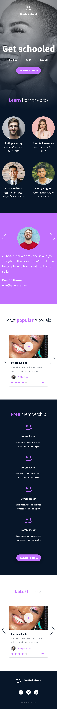
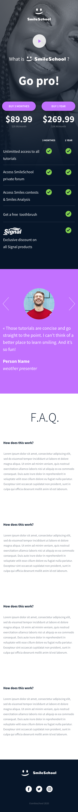

# holberton-smiling-school

In this project, I have to implement 3 web pages with Bootstrap. using all HTML/CSS/Accessibility/Responsive design/Bootstrap knowledges learned in the previous projects.

The objective is simple: Have fully functional web pages that look the same as the designer file.

This webpage has been designed by Nicolas Philippot, UI/UX designer

## HERE THE FINAL RESULT

### WEB-PAGE 1

<table align=center width=100%>
  <tr>
    <td>Desktop view</td>
    <td>Tablet view </td>
    <td>Mobile view</td>
  </tr>
  <tr>
    <td></td>
     <td></td>
    <td></td>
  </tr>
 </table>

### WEB-PAGE 2

<table align=center width=100%>
  <tr>
    <td>Desktop view</td>
    <td>Tablet view </td>
    <td>Mobile view</td>
  </tr>
  <tr>
    <td></td>
     <td></td>
    <td></td>
  </tr>
 </table>

 ### WEB-PAGE 3

<table align=center width=100%>
  <tr>
    <td>Desktop view</td>
    <td>Tablet view </td>
    <td>Mobile view</td>
  </tr>
  <tr>
    <td></td>
     <td></td>
    <td></td>
  </tr>
 </table>
